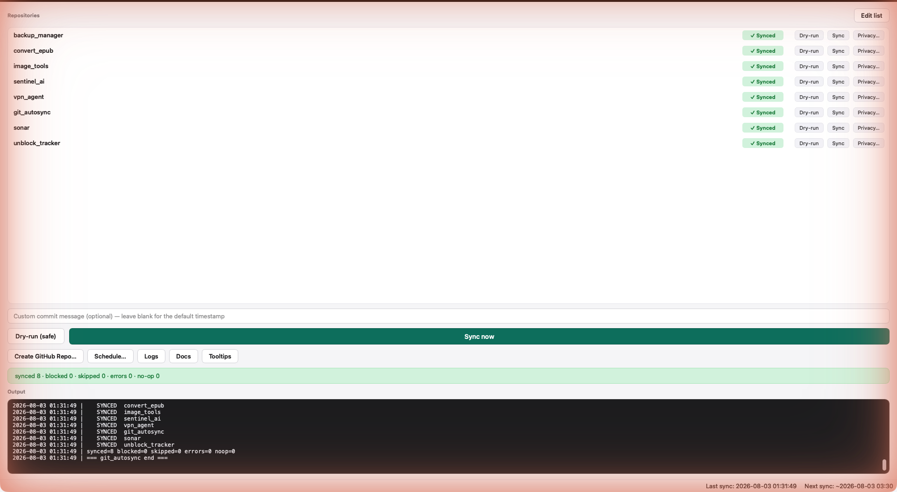

# git_autosync



Leak-gated auto commit & push for your GitHub projects.

This is its own project repo (`~/Documents/lab/active/git_autosync`). It holds the
CLI engine (`git_autosync.sh`, tested and canonical) plus a PySide6 desktop GUI
(`app/`) that wraps the same engine — see `HANDOVER.md` for the full design notes.
Tests live in `tests/` (`test_runner.py`).

For every repo listed in `autosync_repos.txt`, the tool:

1. **Stages** all changes (respecting each repo's `.gitignore`).
2. **Scans** with [gitleaks](https://github.com/gitleaks/gitleaks) — both the staged
   changes *and* the existing git history.
3. If a secret is found, that repo is **BLOCKED**: nothing is committed or pushed,
   and the run is flagged. If clean, it **commits** and **pushes**.

The scan is a hard gate. No clean scan, no push. This is what stops an API key,
password, or token from ever reaching GitHub.

## One-time setup

Install gitleaks (the scanner) — once:

```bash
brew install gitleaks
```

Your repos also need a GitHub `origin` remote already set (either via the
`setup_github.command` script, or via this tool's own `--create-remote` flag /
the GUI's **Create GitHub repo...** button — see below). Repos without a remote
are skipped during normal syncs.

If you want to publish new repos, you also need the
[GitHub CLI](https://cli.github.com), authenticated:

```bash
brew install gh
gh auth login
```

## Usage

From this folder (`~/Documents/lab/active/git_autosync`):

```bash
./git_autosync.sh            # sync every repo in the config
./git_autosync.sh --dry-run  # scan + show what WOULD happen; never commits/pushes
./git_autosync.sh --repo sentinel_ai   # just one repo
```

Or simply **double-click `git_autosync.command`** in Finder.

**Tip:** run `--dry-run` first whenever you're unsure — it's completely read-only.

## Choosing which repos are synced

Edit `autosync_repos.txt`. One repo per line; a bare name like `sentinel_ai`
resolves under `~/Documents/lab/active/`. Comment lines start with `#`.

The GUI's **Edit list** button opens this file in your default editor. The app
automatically reloads the list the moment you save the file — no restart needed.

Any repo whose history still contains committed secrets should be left out until
it's cleaned — and even if you add one early, the history scan will keep blocking
it, by design.

> **The file the engine actually reads** is
> `~/Library/Application Support/git_autosync/autosync_repos.txt`, set via
> `AUTOSYNC_CONFIG` in the LaunchAgent plist. The copy in this repo is the seed
> and the reference. Edit the first one to change what runs tonight — checking
> the wrong one is how seven repos sat unsynced for days while the nightly log
> reported success.

### Two modes

A line may carry a flag after the repo name:

```
backup_manager              # sweep (the default)
imprint  push-only
```

| Mode | What it does |
|---|---|
| **sweep** (default) | `git add -A`, commit everything as `autosync: <timestamp>`, push. |
| **push-only** | Push commits that already exist. Never stages, never commits, never publishes a branch that has no upstream. |

Use **push-only** for any repo a person or an agent is actively working in.

A sweep is right for a repo nobody edits between runs — a config file you
change by hand and never commit is exactly what it is for. It is wrong for a
repo mid-change, because it rolls several unrelated half-finished edits into
one commit whose message describes none of them. That is worse than not backing
them up: it looks like history, and unpicking it later means reading diffs to
work out which lines belonged to which piece of work. `imprint` collected three
such commits on consecutive nights, one of which buried most of a documentation
rewrite.

push-only also declines to push a branch with no upstream. autosync pushes
whichever branch is checked out, so without that a timer can make a feature
branch public under a name nobody chose to publish.

The gitleaks **history** scan runs in both modes — it covers everything about
to be published. The **staged** scan is skipped in push-only, because nothing
is staged and scanning an empty index would report a clean result that was
never actually performed.

## Publishing a new project to GitHub

A repo with no `origin` remote is normally just **SKIP**ped — autosync never
decides on its own to make something public. To actually publish one, pass
`--create-remote`:

```bash
./git_autosync.sh --repo my_new_project --create-remote private   # or: public
```

This still runs the full leak-gate first (staged changes + history). Only if
that's clean does it call `gh repo create --source=. --remote=origin --push`.
If a secret is found, nothing is created or pushed.
The repo also needs to already be listed in `autosync_repos.txt` (the GUI's
**Create GitHub repo...** dialog adds it for you automatically).

## Custom commit messages

By default autosync generates a timestamped message:
`autosync: 2026-06-27 00:34:00`

You can override this in two ways:

- **GUI:** type a message in the commit message field before clicking Sync.
- **CLI:** set the `AUTOSYNC_COMMIT_MSG` environment variable:
  ```bash
  AUTOSYNC_COMMIT_MSG="refactor: tidy up" ./git_autosync.sh --repo my_repo
  ```

If you want a meaningful message but don't want to type it every time, just commit
by hand (`git commit -m "..."`) before running autosync — the tool only makes its
own commit when there are un-committed changes.

## Logs

Every run appends to `logs/autosync_YYYYMMDD.log`, including the gitleaks output
(secrets are redacted in the log, never written in clear text).

Override the log location with `AUTOSYNC_LOG_DIR` (the GUI always does this,
pointing at `~/Library/Application Support/git_autosync/logs/`).

## Last-sync state

After any **real** (non-dry-run) invocation, the script writes a timestamp to
`last_sync.txt` in `AUTOSYNC_STATE_DIR` (defaults to the script's own folder;
the GUI points this at its Application Support folder). Dry-runs never touch
it. This is how the GUI's status bar stays accurate regardless of whether a sync
was triggered by hand or by the background schedule.

## Exit codes

- `0` — everything synced or nothing to do.
- non-zero — at least one repo was **blocked** or errored.

## Running it on a schedule

The easiest way is the GUI's **Schedule sync...** button — it installs a `launchd`
LaunchAgent for you with no manual plist editing.

To do it by hand instead, install a LaunchAgent pointing `ProgramArguments` at
this script and set `AUTOSYNC_CONFIG` / `AUTOSYNC_LOG_DIR` / `AUTOSYNC_STATE_DIR` /
`GITLEAKS_CMD` / `GH_CMD` in `EnvironmentVariables` as explicit absolute paths
(Finder/launchd processes don't inherit your shell's `PATH`) — see
`app/scheduler.py` for a working example.

## What it will not do for you

It commits and pushes on a timer, which makes it a poor fit for a repo whose
history anyone reads. Two limits worth knowing before adding a project:

* **Sweep mode writes the commit message.** Everything in the tree lands as
  `autosync: <timestamp>`. If the work deserved a message, use `push-only` and
  commit it yourself.
* **It pushes the branch that happens to be checked out.** In sweep mode a
  branch with no upstream is published, which on a feature-branch repo means a
  timer can make work in progress public. `push-only` declines instead.

## How it stays safe

- Secrets in *new changes* → blocked before the commit is ever made.
- Secrets already in *history* → blocked before any push.
- gitleaks errors (can't run) → treated as failure, repo skipped — never a silent pass.
- `--dry-run` makes zero changes to your repos or GitHub.
- `--create-remote` runs through the same gate before `gh repo create --push` is
  ever called — a detected secret blocks repo creation entirely, not just the push.

## Handling blocked repos

After a blocked run, the **Output** pane shows a **Leak report** with the flagged
file, line number, and rule. Two quick-action buttons appear on the blocked row:

**If it's a false positive** (a variable name, SQL column, etc. that looks like
a secret but isn't):
- Click **Allowlist** on the repo row — one click, adds the fingerprint to
  `.gitleaksignore`, done.
- Or click **Fix leak…** → choose *False positive* → same result via a dialog.

**If it's a real secret** (API key, token, password accidentally committed):
- Click **Fix leak…** → choose *Real secret — remove from online repo history*.
- The app runs `git-filter-repo` to scrub the value from every commit and
  force-pushes to origin. Your local files are not modified.
- Requires `brew install git-filter-repo` if not already installed.

After either action, run a dry-run to confirm the repo is unblocked.

You can also manage `.gitleaksignore` by hand: one fingerprint per line, in the
format gitleaks uses (`<commit>:<file>:<rule>:<line>`).

---

## Desktop app (GUI)

A PySide6 GUI wraps the same engine — it never reimplements the leak-gate logic,
it just shells out to `git_autosync.sh` (and, for repo creation, `gh`) via
`QProcess`.

### Main window

**Repositories section:**

- **Repo list** — one row per repo in `autosync_repos.txt`. Each row shows:
  - A **checkbox** — include or exclude this repo from bulk Dry-run / Sync now.
    The header carries its own tristate checkbox, lined up in the same column as the
    rows' own boxes, instead of separate All/None buttons off to the side — checked when
    every repo is, unchecked when none is, and shown partial otherwise; clicking it
    checks or clears every row.
  - The repo name first, followed by its containing folder path in muted text. Column
    headers keep the checkbox, repository, last-commit, status, and action fields aligned.
  - A row for a repo whose folder can no longer be found on disk goes grey and disabled
    except for a **Remove** button, which drops just that entry from
    `autosync_repos.txt` — no files and no GitHub repo are touched.
  - A **last-commit time** — human-readable ("5m ago", "2h ago", "3d ago"), read
    straight from git rather than from git_autosync's own push bookkeeping — a
    repo changed by an editor, another tool, or an agent no longer reads as
    stale just because git_autosync itself hasn't pushed it. Shown as an amber
    "no commits" pill only when the repo has no commits at all. Hover the time
    for the exact commit timestamp plus when git_autosync itself last pushed.
  - A colored **status badge** after each run:
    `✓ Synced` (green) · `✕ Blocked` (red) · `⊘ Skipped` (grey) ·
    `⚠ Error` (amber) · `No changes` (grey).
  - **Dry-run** button — scans just this repo, never commits or pushes.
  - **Sync** button — syncs just this repo after the leak-gate clears it.
    Shows a diff preview of pending changes (with human-readable labels —
    "modified", "new file", "untracked", etc.) before you confirm.
  - **Publish to GitHub…** button (replaces Sync) for repos with no remote yet.
  - **Privacy…** button — toggle the repo between public and private on GitHub
    (`gh repo edit --visibility …`). Label shows the current state once fetched
    (🔒 Private / 🌐 Public) — on each refresh, visibility for every repo is
    looked up via `gh api repos/<owner>/<repo>` on a background timer so the
    list stays responsive. Toggling updates the button label immediately
    without waiting for the next refresh.
  - **Fix leak…** button — appears on every row; turns red while the repo is
    currently blocked, back to normal once it clears. Opens a triage dialog:
    - *Real secret*: rewrites the full git history with `git-filter-repo`
      (replacing the flagged value with `[REDACTED]`) and force-pushes to
      origin. Your local files are never modified.
    - *False positive*: adds the fingerprint to `.gitleaksignore` in one step.
  - **Allowlist** button — appears on a row only after a blocked run. One click
    to add the gitleaks fingerprint to `.gitleaksignore` with no further dialogs.
- **Auto-reload** — the list refreshes automatically when you save
  `autosync_repos.txt`, with no restart needed (`QFileSystemWatcher`).
- **Config-entry identity** — status is keyed by the configured entry, not only the leaf
  folder name. Nested repositories therefore keep distinct last-sync timestamps and no
  longer collapse into a misleading “never” state.

**Commit message field:**

Type a custom commit message before syncing. Leave it blank to use the default
timestamped message (`autosync: YYYY-MM-DD HH:MM:SS`). The message is passed via
the `AUTOSYNC_COMMIT_MSG` env var to the engine script.

**Primary actions:**

- **Dry-run (safe)** — scans checked repos; never commits or pushes. Safe to run any time.
- **Sync now** — commits and pushes checked repos after the leak-gate. When a subset
  of repos is checked, each is run sequentially via `--repo`. Disabled until gitleaks
  is found on disk, with an install hint shown in a banner.
  Shows a **diff preview** with human-readable labels before you confirm.

**Secondary actions:**

- **Find repos…** — scans the Lab workspace, compares discovered Git repositories with
  the effective config, and offers a reconciliation preview. Missing configured paths
  remain visibly disabled after a run, and a banner explains when the saved list has
  drifted from what exists on disk.
- **Create GitHub Repo…** — lists local projects under `~/Documents/lab/active/`
  that don't have a GitHub remote yet, lets you pick visibility, adds the repo to
  the config list, then runs the `--create-remote` flow. Shows the new repo's URL
  on success.
- **Schedule…** — configure a background `launchd` job: "run every" (15 min /
  30 min / 1 h / 6 h / 12 h / 24 h) or "run daily at" a specific time. Shows the
  current schedule; lets you update or disable it.
- **Logs** — reveals the log folder in Finder.
- **Docs** — renders this README in an in-app viewer, with a "Last updated" badge
  reading the README's own commit date (falling back to its file mtime for a
  frozen bundle with no `.git`), so a stale page is obvious rather than trusted.
- **Tooltips** — toggles explanatory tooltips on every control.
- **Edit list** — opens `autosync_repos.txt` in your default editor.

**Output pane:**

Live log output from the engine script, with ANSI colour codes stripped for
readability. After a blocked run, the output pane appends a **leak report**
listing the file, rule, and fingerprint that triggered the gate for each blocked
repo, so you know exactly what to fix without opening the log file.

**Status bar:**

- **Last sync** — timestamp from the engine's own state file (accurate whether
  the last run was manual or scheduled).
- **Next sync** — computed from the active schedule, or "not scheduled".

**macOS notifications:**

After every real sync the app fires a macOS notification (`display notification`)
with a summary of how many repos were synced, blocked, and skipped. The
notification appears in Notification Centre even if the app window is hidden.

### Tray icon and background behaviour

The app lives in the macOS menu bar as a coloured dot:
- **Green** — last run completed with no blocks or errors.
- **Red** — at least one repo was blocked or errored.
- **Grey** — no real run has completed yet.

Closing the main window does **not** quit the app — it hides to the tray so
scheduled syncs keep running in the background. Neither does ⌘Q or the Dock's
**Quit**: both hide the window and drop the app out of the Dock, leaving it
running in the menu bar. macOS will report the quit as cancelled; that is the
app declining to exit, not an error.

To reopen: click the tray dot, or launch the app again from Finder — the second
launch signals the running copy to come back to the Dock and un-hide.

To quit fully, ending background syncs, use the **Quit** button at the bottom of
the window (it asks first) or **Quit** in the tray menu. Those are the only two
exits — ⌘Q and the Dock deliberately hide instead, so a menu bar app is not
killed by the gesture that closes a window.

The tray menu also has quick **Dry-run** and **Sync now** actions so you don't
need to open the window at all.

The app is **single-instance**: launching a second copy raises the existing
window instead of opening a duplicate. Launching with `--background` skips
both the window and the raise — the socket message tells the running instance
to stay hidden — for starting the app unobtrusively (e.g. at login) without
stealing focus.

### Running from source

```bash
uv venv .venv && source .venv/bin/activate
uv pip install -r requirements.txt
python -m app.main
```

### Building the standalone `.app`

```bash
./build_app.sh
```

Installs to `/Applications/git_autosync.app`. The script deletes `build/` and
`dist/` after installing so Spotlight never indexes a second copy.

The app is ad-hoc signed (`codesign --force --deep -s -`), so the first launch
needs right-click → Open (no Apple Developer ID / notarization yet).

### Notes

- **macOS 27 crash guard.** An Objective-C exception raised inside AppKit's event
  dispatch (the trigger seen was `-[NSEvent clickCount]` inside libqcocoa on a tray
  click) unwinds into C++ and aborts the whole process with nothing written anywhere.
  `app/macos_guard.py` registers `NSApplicationCrashOnExceptions = NO` before
  `QApplication` is constructed, and installs an uncaught-exception handler that
  appends the exception name, reason, and call stack to `crash.log` in the app's log
  directory — so a crash that still gets through leaves evidence instead of a silent
  abort. Pure ctypes, no PyObjC dependency.
- Config, logs, and last-sync state live in
  `~/Library/Application Support/git_autosync/` (the packaged bundle is
  read-only), seeded from `autosync_repos.txt` on first run.
- The packaged app resolves `gitleaks` / `git` / `gh` explicitly (checking
  `/opt/homebrew/bin`, `/usr/local/bin`, then `PATH`) because Finder-launched
  apps don't inherit your shell's PATH.
- The app icon (`packaging/icon.icns`) is generated by `packaging/make_icon.py`.
  Regenerate it with:
  ```bash
  python packaging/make_icon.py && cd packaging && iconutil -c icns icon.iconset -o icon.icns && rm -rf icon.iconset
  ```

## Git identity

Commits use a pseudonymous identity, not a real name/email — `git config --global
user.name / user.email` should already be set to the `wwds-dev` GitHub noreply
identity. Don't hardcode a real name/email anywhere in this project.

## Version

`v<MAJOR>.<BUILD>` — e.g. `v2.051`. **MAJOR** is the product arc, the only
hand-edited part, in the `VERSION` file at the project root. **BUILD** is
`git rev-list --count HEAD`, zero-padded to three digits, so it is derived and
cannot be forgotten: a hand-maintained build number is wrong the first time
someone ships without remembering it, and then silently wrong forever.

The number is shown in the window title. A frozen `.app` has no `.git`, so
`scripts/stamp_version.py` writes `_build_info.json` at package time and
`app/version.py` reads it back; a checkout prefers live git, so an edit shows up on
the next launch without re-stamping. With neither, it says `v2.???` rather than
inventing a number — claiming a version with no evidence is a lie told in
exactly the moment someone is asking.

This is the lab-wide scheme, shared with `imprint`, `sonar` and `lab_hub`, and
the Lab Project Monitor computes the same string from the same two inputs, so
the dashboard and the running app cannot disagree.
